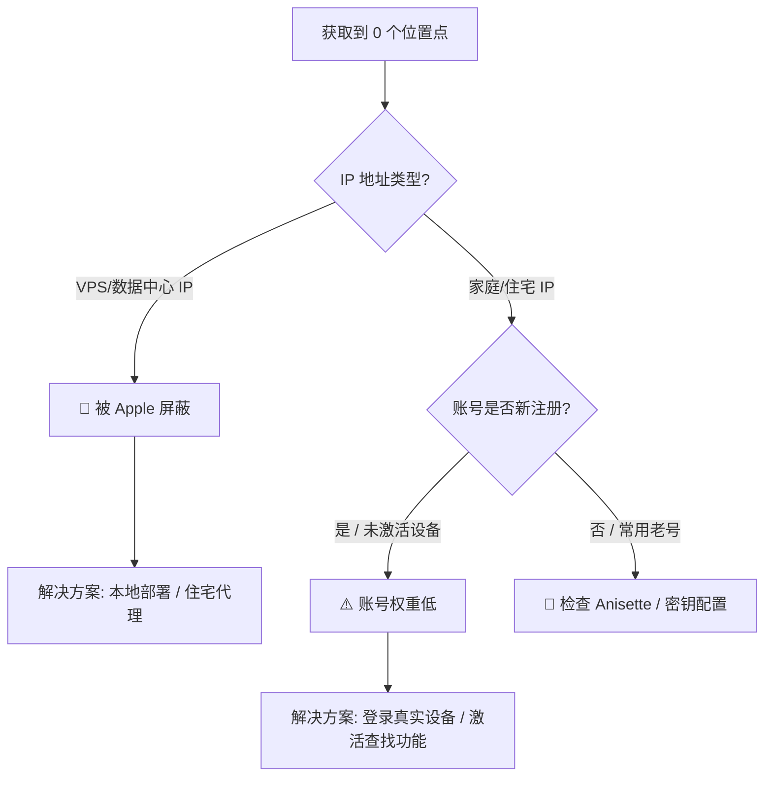

# 故障排除：为什么获取到的位置点为 0？

如果您在 macless-haystack 或 GetandUpTracks 中看到日志显示获取成功，但返回的位置报告数量始终为 0，这通常是由以下几个原因造成的。

## 1. 🚨 IP 地址被 Apple 封锁（最常见原因）

Apple 的服务器对非居民 IP（数据中心/VPS IP）非常敏感。如果您的服务器部署在云厂商那里，Apple 极有可能阻止了该 IP 的 Find My 数据请求。

### 受影响的常见 VPS 提供商

- **DigitalOcean**
- **Linode / Akamai**
- **Vultr**
- **AWS (Amazon Web Services)**
- **Google Cloud Platform (GCP)**
- **Azure**
- **Hetzner**
- **OVH**
- 以及大多数提供廉价 VPS 的厂商。

> **表现症状**：登录可能成功，Anisette 服务器运行正常，但请求 `search` 接口时虽然状态码是 200，但返回的 payload 为空或仅包含空列表。

### ✅ 解决方案

1. **本地部署（推荐）**：在您自己的 Mac 或 PC（家庭宽带环境）上运行脚本。这是最稳妥的方法。
2. **使用住宅代理（Residential Proxy）**：如果您必须在 VPS 上运行，需要配置 HTTP 代理，让流量通过住宅 IP 转发。
3. **更换冷门 VPS**：寻找提供住宅 IP 或未被 Apple 标记的小型 ISP 厂商（但风险较高，随时可能被封）。

---

## 2. ⚠️ Apple ID 信任评分过低

Apple 有一套内部的“信任评分”系统。如果您的 Apple ID 是为了这个项目专门新注册的，且没有任何真实设备的使用记录，Apple 可能会拒绝向该账号返回 Find My 数据。

### 触发条件

- 账号刚刚注册。
- 账号未绑定手机号或双重认证（2FA）。
- **账号从未在真实的 Apple 设备（iPhone/iPad/Mac）上登录过。**
- **账号从未在真实设备上打开过“查找” (Find My) App。**

### ✅ 解决方案（“养号”指南）

为了让账号被 Apple 视为“正常用户”，您需要进行以下操作：

1. **登录真实设备**：找一台旧的 iPhone 或 Mac，登录这个 Apple ID。
2. **激活“查找”功能**：在设备的 iCloud 设置中，确保“查找我的 iPhone/Mac”已开启。
3. **接受条款**：打开“查找” App，如果弹出新的服务条款或欢迎界面，请点击接受/继续。
4. **模拟正常使用**：浏览一下地图，点击一下设备列表。
5. **绑定支付方式**（可选）：绑定一张银行卡（无需消费）有时能显著提高账号权重。
6. **等待时间**：新账号可能需要 24-48 小时才能“生效”。

---

## 3. 🛠️ Anisette 数据无效

虽然较少见，但如果 Anisette 数据生成不正确（例如使用了旧版协议），Apple 也可能拒绝请求。

### ✅ 解决方案

- 确保使用的是 `v3` 版本的 Anisette 服务器（当前脚本默认已配置为 v3）。
- 如果怀疑 Anisette 有问题，尝试重启 Anisette 容器重置数据：`docker restart anisette`。

---

## 总结流程图

