# Troubleshooting: Why are there 0 location reports?

If you see logs in `macless-haystack` or `GetandUpTracks` indicating successful fetching, but the number of location reports returned is consistently 0, this is usually caused by the following reasons.

## 1. 🚨 IP Address Blocked by Apple (Most Common)

Apple's servers are very sensitive to non-residential IPs (Data Center/VPS IPs). If your server is hosted by a cloud provider, Apple has likely blocked Find My data requests from that IP.

### Common Affected VPS Providers

- **DigitalOcean**
- **Linode / Akamai**
- **Vultr**
- **AWS (Amazon Web Services)**
- **Google Cloud Platform (GCP)**
- **Azure**
- **Hetzner**
- **OVH**
- And most providers offering cheap VPS services.

> **Symptoms**: Login might succeed, Anisette server runs fine, but when requesting the `search` endpoint, although the status code is 200, the returned payload is empty or contains only an empty list.

### ✅ Solutions

1. **Local Deployment (Recommended)**: Run the script on your own Mac or PC (Home Broadband environment). This is the most reliable method.
2. **Use Residential Proxy**: If you must run on a VPS, you need to configure an HTTP proxy to route traffic through a residential IP.
3. **Switch to Niche VPS**: Look for small ISP providers that offer residential IPs or haven't been flagged by Apple yet (High risk, can be blocked at any time).

---

## 2. ⚠️ Low Apple ID Trust Score

Apple has an internal "Trust Score" system. If your Apple ID was newly registered specifically for this project and has no history of use on real devices, Apple may refuse to return Find My data to this account.

### Trigger Conditions

- Account was just registered.
- Account has no phone number bound or 2FA enabled.
- **Account has never logged into a real Apple device (iPhone/iPad/Mac).**
- **Account has never opened the "Find My" app on a real device.**

### ✅ Solutions ("Warming Up" the Account)

To make your account appear as a "normal user" to Apple, you need to:

1. **Log into a Real Device**: Find an old iPhone or Mac and log in with this Apple ID.
2. **Enable "Find My"**: In the device's iCloud settings, ensure "Find My iPhone/Mac" is turned on.
3. **Accept Terms**: Open the "Find My" app; if a new Terms of Service or Welcome screen appears, tap Accept/Continue.
4. **Simulate Normal Usage**: Browse the map a bit, tap on the device list.
5. **Add Payment Method** (Optional): Binding a bank card (no purchase necessary) can sometimes significantly increase account weight.
6. **Wait**: New accounts may need 24-48 hours to "take effect".

---

## 3. 🛠️ Invalid Anisette Data

Although less common, if the Anisette data generation is incorrect (e.g., using an old protocol version), Apple might also reject requests.

### ✅ Solution

- Ensure you are using a `v3` Anisette server (The current script works with v3 by default).
- If you suspect Anisette issues, try restarting the container to reset data: `docker restart anisette`.

---

## Summary Flowchart

```mermaid
graph TD
    A[Got 0 Location Reports] --> B{IP Address Type?}
    B -->|VPS/Data Center IP| C[🚫 Blocked by Apple]
    B -->|Home/Residential IP| D{New Account?}
    C --> E[Solution: Local Deploy / Residential Proxy]
    D -->|Yes / No Device| F[⚠️ Low Account Score]
    D -->|No / Active Account| G[🤔 Check Anisette / Keys]
    F --> H[Solution: Log in Real Device / Enable Find My]
```

